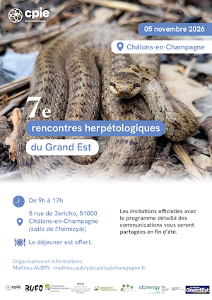

- 5 novembre 2026 : 7èmes rencontres herpétologiques du Grand Est dans la salle de l'hémicycle de l'Hôtel de région 5 rue de Jericho à Châlons-en-Champagne (51). De 9h à 17h.

- 5 au 7 juin 2026 : 24h de la biodiversité dans la vallée des Éclusiers (Moselle sud). Plus d'informations [sur le lien suivant](https://www.odonat-grandest.fr/24h-biodiv-vallee-eclusiers-2026/){.external target="_blank"}
