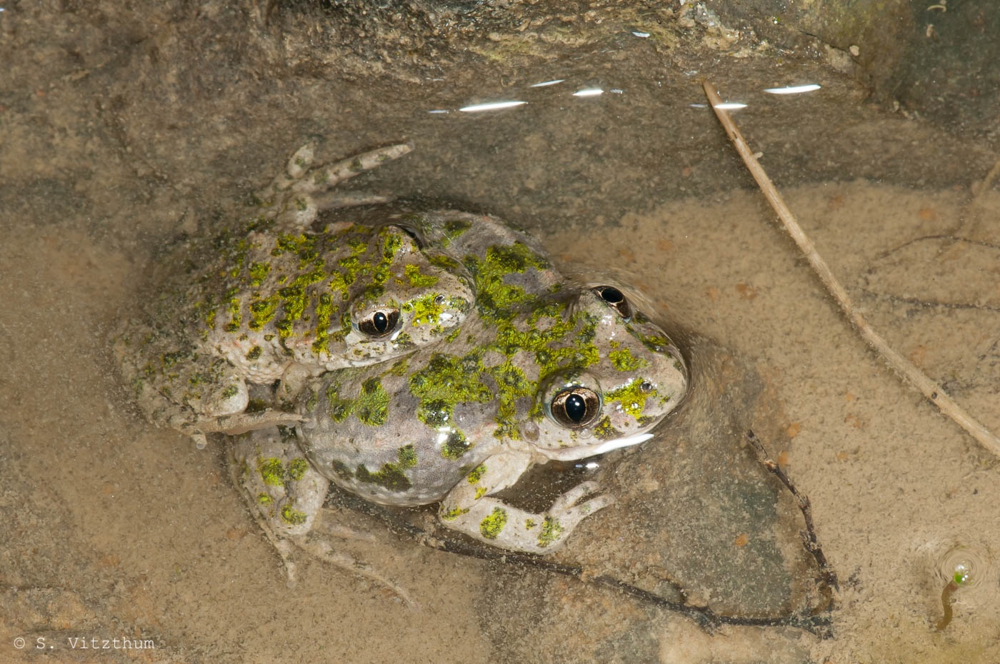
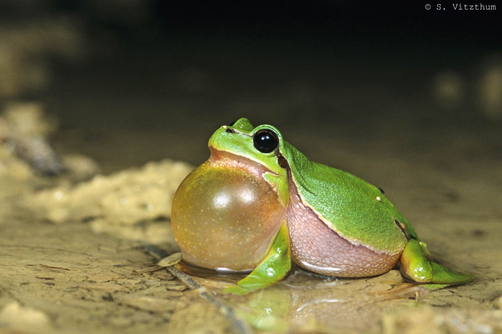

La Lorraine compte 18 espèces d'amphibiens autochtones, une espèce et un taxon (sous-espèce) introduits.

# Urodèles
- *Ichthyosaura alpestris*, le Triton alpestre
- *Lissotriton helveticus*, le Triton palmé
- *Lissotriton vulgaris*, le Triton ponctué
- *Salamandra salamandra*, la Salamandre tachetée
- *Triturus cristatus*, le Triton crêté

# Anoures
- *Alytes obstetricans*, l'Alyte accoucheur
- *Bombina bombina*, le Sonneur à ventre de feu *introduit
- *Bombina variegata*, le Sonneur à ventre jaune
- *Pelodytes punctatus*, le Pélodyte ponctué
- *Pelobates fuscus*, le Pélobate brun
- *Bufo bufo*, le Crapaud commun
- *Bufotes viridis*, le Crapaud vert
- *Epidalea calamita*, le Crapaud calamite
- *Hyla arborea*, la Rainette verte
- *Pelophylax lessonae*, la Grenouille de Lessona
- *Pelophylax* kl. *esculentus*, la Grenouille verte
- *Pelophylax ridibundus*, la Grenouille rieuse
- *Pelophylax ridibundus kurtmuelleri*, la Grenouille rieuse des Balkans *introduite
- *Rana dalmatina*, la Grenouille agile
- *Rana temporaria*, la Grenouille rousse

:::{layout-ncol=2}

Couple de Pélodytes ponctués

Rainette verte

:::

