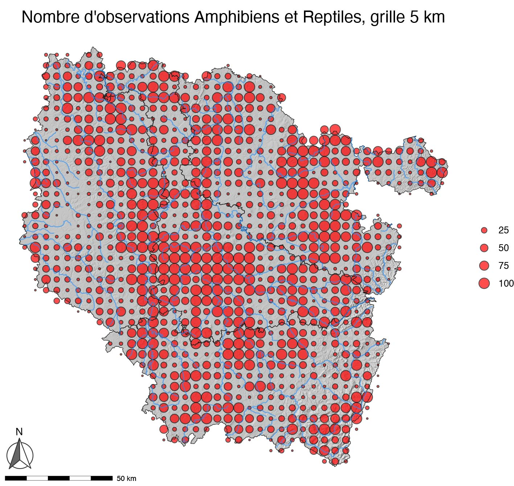
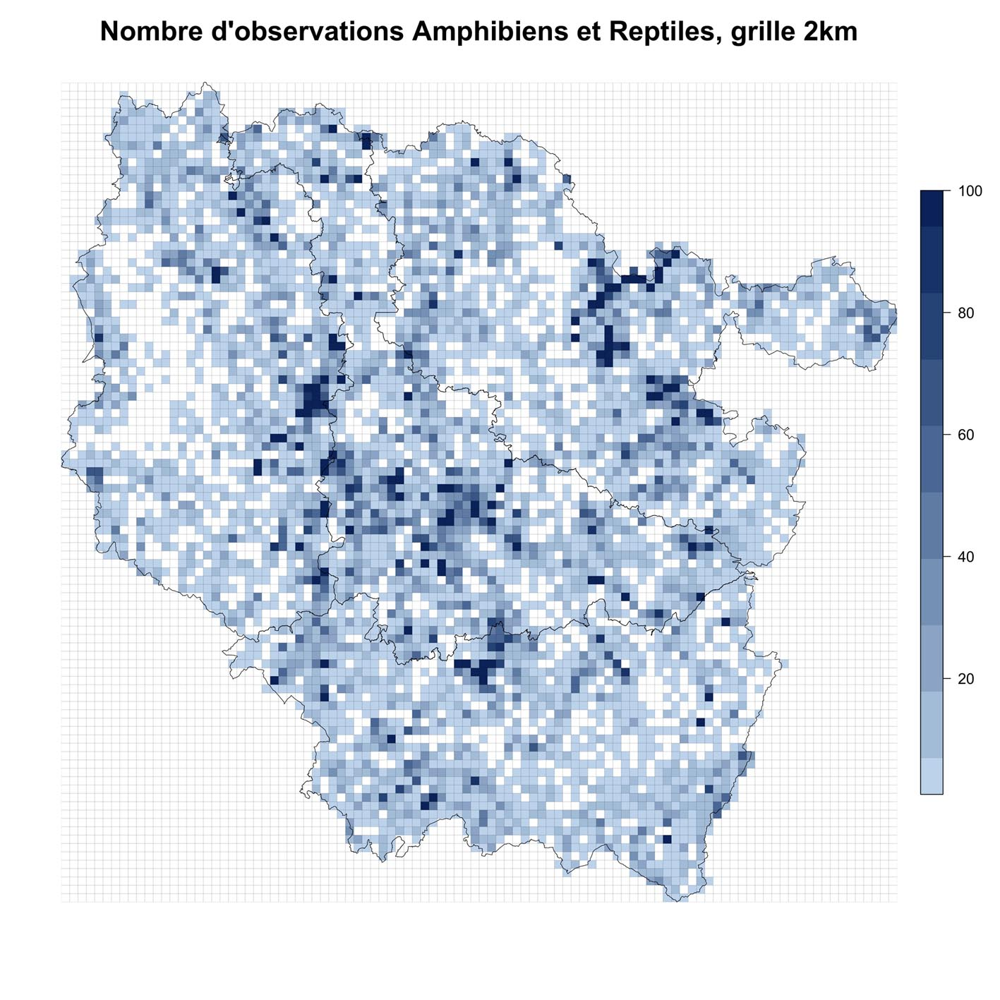
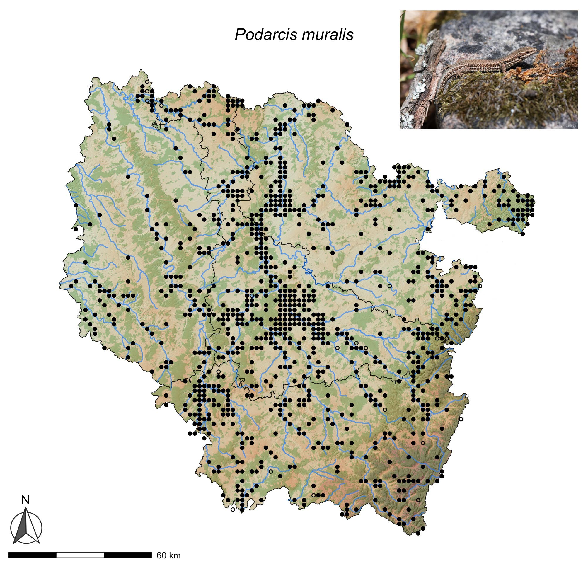

## Informations générales sur l'atlas

HYLA supervise l'atlas de répartition des Amphibiens et Reptiles de Lorraine, dans la continuité du projet d'atlas de la Commission Amphibiens et Reptiles de Lorraine (CRA) piloté par Damien Aumaître, qui reste le coordinateur de l'atlas actuel.

Le projet d'atlas est en cours et nous invitons les naturalistes et observateurs à saisir leurs données d'Amphibiens et de Reptiles dans la plateforme régionale [faune-grandest](https://www.faune-grandest.org/index.php){.external target="_blank"}

Vous pouvez également saisir vos données avec l'application pour smartphone [Naturalist](https://play.google.com/store/apps/details?id=ch.biolovision.naturalist&hl=fr){.external target="_blank"}. Les données saisies via Naturalist sont directement associées à votre compte VisioNature. Elles sont ensuite synchronisées vers la base régionale. Un tuto au format pdf est disponible en cliquant sur l'image ci-dessous :

La validation des données en Lorraine est assurée par Damien Aumaître et Jean-Pierre Vacher. Un mémo sur la validation des données herpétologiques dans le Grand Est est à l'étude et sera diffusé probablement en fin d'année 2026.

## Carte de pression d'observation

À titre informatif, nous donnons ci-dessous trois cartes qui montrent un état des lieux en 2025 du nombre d'observations par mailles de 5 x 5 km et 2 x 2 km, ainsi que la carte à la maille 2 x 2 km du Lézard des murailles, *Podarcis muralis*, qui est probablement l'espèce de reptiles la plus courante et la plus facile à observer, mais pour laquelle il manque encore beaucoup de données dans notre base.

## Communes sans données - 2026
Il reste encore beaucoup de communes en Lorraine sans aucune donnée herpétologique, notamment en Moselle. Pourtant, des espèces communes comme le Lézard des murailles ou le Crapaud commun doivent s'y rencontrer. N'hésitez pas à enregistrer vos observations dans [faune-grandest](https://www.faune-grandest.org/index.php{.external target="_blank"}) si d'aventure vous passiez par l'une ou l'autre de ces communes, dont nous donnons la liste actualisée en 2026 ci-dessous.

### Meurthe-et-Moselle

En 2026, 55 communes de Meurthe-et-Moselle sont dépourvues de données herpétologiques :

:::: {.columns}
::: {.column}
Avricourt, Bauzemont, Bettainvillers, Beuvillers, Bienville-la-Petite, Borville, Bratte, Brouville, Coincourt, Courbesseaux, Crusnes, Cutry, Diarville, Domptail-en-l'Air, Drouville, Éply, Erbéviller-sur-Amezule, Flainval, Franconville, Grosrouvres, Haigneville, Halloville, Houdelmont, Igney, Juvrecourt, Lalœuf, Landécourt, 
:::

::: {.column}
Malavillers, Malleloy, Manoncourt-en-Vermois, Moineville, Montigny, Moriviller, Moutiers, Noviant-aux-Prés, Ognéville, Parux, Port-sur-Seille, Raucourt, Réchicourt-la-Petite, Réclonville, Reherrey, Repaix, Romain, Rouves, Saint-Supplet, Sornéville, Tellancourt, Thézey-Saint-Martin, Tiercelet, Valhey, Vandelainville, Villers-la-Chèvre, Villers-lès-Moivrons, Vroncourt
:::
::::

### Meuse

En 2026, 37 communes de Meuse sont dépourvues de données herpétologiques :

:::: {.columns}
::: {.column}
Aincreville, Avillers-Sainte-Croix, Baulny, Béthelainville, Blanzée, Brabant-le-Roi, Brocourt-en-Argonne, Cléry-le-Grand, Courouvre, Cuisy, Cunel, Dombasle-en-Argonne, Domremy-la-Canne, Épinonville, Érize-la-Brûlée, Heippes, Jouy-en-Argonne, Julvécourt,
:::

::: {.column}
Le Neufour, Les Trois-Domaines, Levoncourt, Maizeray, Marchéville-en-Woëvre, Ménil-aux-Bois, Muzeray, Nantillois, Neuville-en-Verdunois, Osches, Rembercourt-Sommaisne, Riaville, Seigneulles, Septsarges, Silmont, Vadelaincourt, Véry, Vigneul-sous-Montmédy, Ville-sur-Cousances
:::
::::

### Moselle

En 2026, 109 communes de Moselle sont dépourvues de données herpétologiques :

:::: {.columns}
::: {.column}
Achain, Alaincourt-la-Côte, Altrippe, Arraincourt, Arriance, Aspach, Aulnois-sur-Seille, Aumetz, Bannay, Barchain, Béchy, Berling, Berviller-en-Moselle, Bettange, Beux, Beyren-lès-Sierck, Bioncourt, Bourscheid, Bréhain, Brouderdorff, Brulange, Buchy, Carling, Château-Rouge, Chieulles, Coin-sur-Seille, Cuvry, Dalhain, Dalstein, Destry, Diffembach-lès-Hellimer, Domnom-lès-Dieuze, Enchenberg, Entrange, Évrange, Failly, Fouligny, Foville, Gandrange, Glatigny, Grindorff-Bizing, Guébestroff, Guerstling, Guinkirchen, Guntzviller, Haboudange, Hartzviller, Heining-lès-Bouzonville, Hellering-lès-Fénétrange, Hérange, Hestroff, Hommert, Honskirch, Hunting, 
:::

::: {.column}
Lambach, Landroff, Laneuveville-en-Saulnois, Laneuveville-lès-Lorquin, Lesse, Liéhon, Lindre-Haute, Lubécourt, Malroy, Marange-Zondrange, Mégange, Meisenthal, Menskirch, Momerstroff, Moncourt, Montdidier, Morville-lès-Vic, Narbéfontaine, Neufvillage, Niedervisse, Noisseville, Nousseviller-Saint-Nabor, Oberdorff, Oriocourt, Pévange, Plesnois, Pommérieux, Pournoy-la-Chétive, Rettel, Richeval, Roupeldange, Saint-François-Lacroix, Saint-Jean-Kourtzerode, Sanry-sur-Nied, Secourt, Semécourt, Serémange-Erzange, Servigny-lès-Sainte-Barbe, Silly-en-Saulnois, Stiring-Wendel, Suisse, Tragny, Tromborn, Valmunster, Vasperviller, Vescheim, Villers-Stoncourt, Villing, Vilsberg, Vœlfling-lès-Bouzonville, Waldwisse, Waltembourg, Wintersbourg, Xocourt, Zilling
:::
::::

### Vosges

En 2026, 36 communes des Vosges sont dépourvues de données herpétologiques :

:::: {.columns}
::: {.column}
Ameuvelle, Aydoilles, Battexey, Baudricourt, Bertrimoutier, Bocquegney, Boulaincourt, Cheniménil, Clérey-la-Côte, Coinches, Domèvre-sous-Montfort, Dommartin-aux-Bois, Dommartin-sur-Vraine, Entre-deux-Eaux, Évaux-et-Ménil, Frénois,  
:::

::: {.column}
Gemaingoutte, Gigney, Hardancourt, La Petite-Fosse, Laveline-du-Houx, Le Beulay, Le Puid, Les Poulières, Luvigny, Ménarmont, Ménil-de-Senones, Ortoncourt, Regney, Remomeix, Saint-Remimont, Vaudéville, Vienville, Vieux-Moulin, Viménil, Xamontarupt
:::
::::