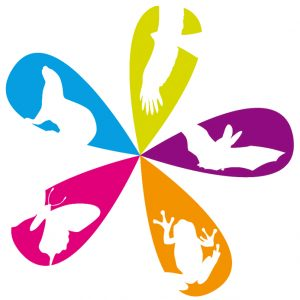

HYLA supervise l'atlas de répartition des Amphibiens et Reptiles de Lorraine, dans la continuité du projet d'atlas de la Commission Amphibiens et Reptiles de Lorraine (CRA) piloté par Damien Aumaître, qui reste le coordinateur de l'atlas actuel.

Le projet d'atlas est en cours et nous invitons les naturalistes et observateurs à saisir leurs données d'Amphibiens et de Reptiles dans la plateforme régionale [faune-grandest](https://www.faune-grandest.org/index.php){.external target="_blank"}

Vous pouvez également saisir vos données avec l'application [Naturalist](https://play.google.com/store/apps/details?id=ch.biolovision.naturalist&hl=fr){.external target="_blank"}. Les données saisies via Naturalist sont directement associées à votre compte VisioNature. Elles sont ensuite synchronisées vers la base régionale. Un tuto au format pdf est disponible en cliquant sur l'image ci-dessous :

La validation des données est assurée par Damien Aumaître et Jean-Pierre Vacher. Un mémo sur la validation des données herpétologiques dans le Grand Est est à l'étude et sera diffusé probablement en fin d'année 2026.