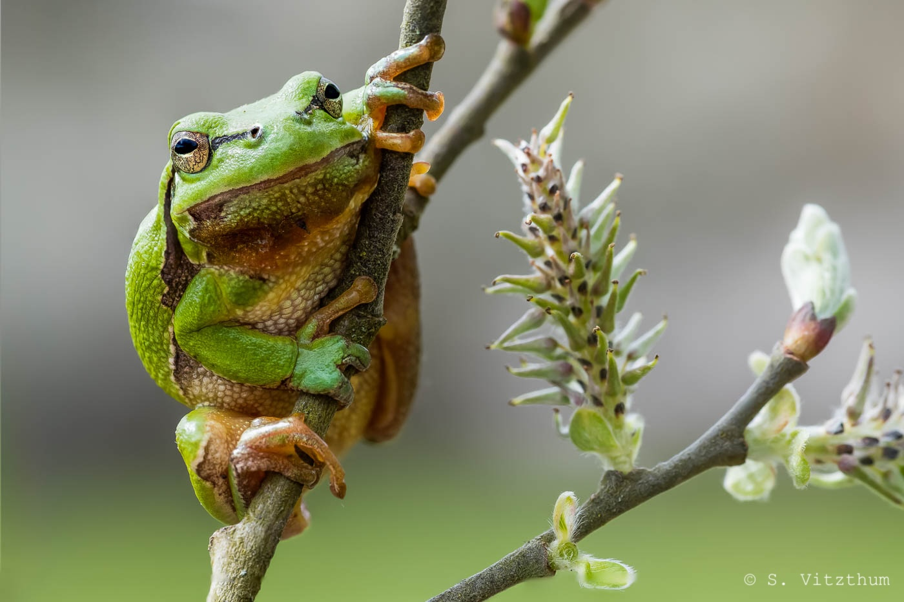
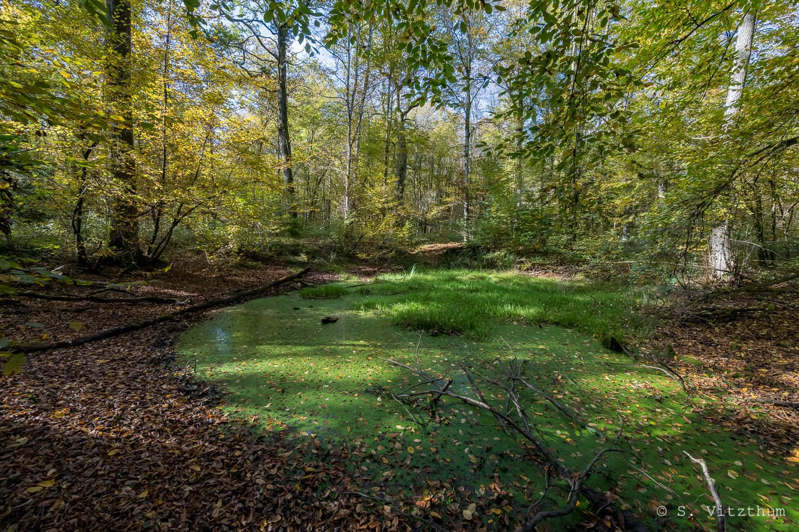

Bienvenue sur le site web de l'association HYLA, consacrée à l'étude et à la protection des Amphibiens et Reptiles de Lorraine.

HYLA est une association de droit local basée en Moselle et qui intervient dans les quatre départements lorrains, dont les objectifs statutaires sont :

- l’étude de toutes les espèces de reptiles et amphibiens et de leurs habitats respectifs,
- la participation à des programmes internationaux, nationaux et régionaux de connaissance et de conservation de l’herpétofaune et de ses habitats,
- la collecte et la diffusion des données concernant l’herpétofaune de Lorraine,
- la préservation et la restauration des habitats de ces espèces,
- l’information et la sensibilisation du public et des acteurs du territoire,
- l’initiation, la vulgarisation et la formation à la connaissance des amphibiens et des reptiles et à leur protection, 
- l’intervention en cas de non-respect de la règlementation en vigueur 

HYLA est membre d'ODONAT Grand Est.

:::{layout-ncol=2}

:::

