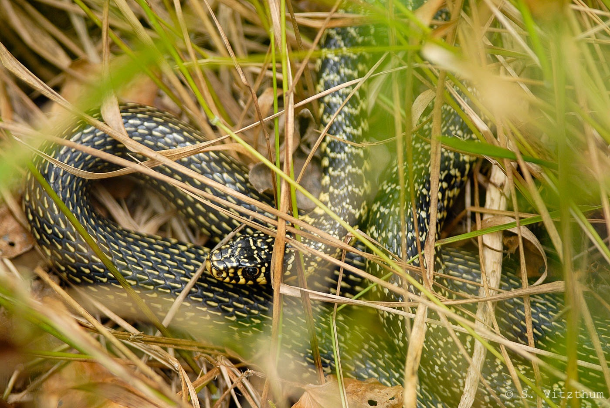
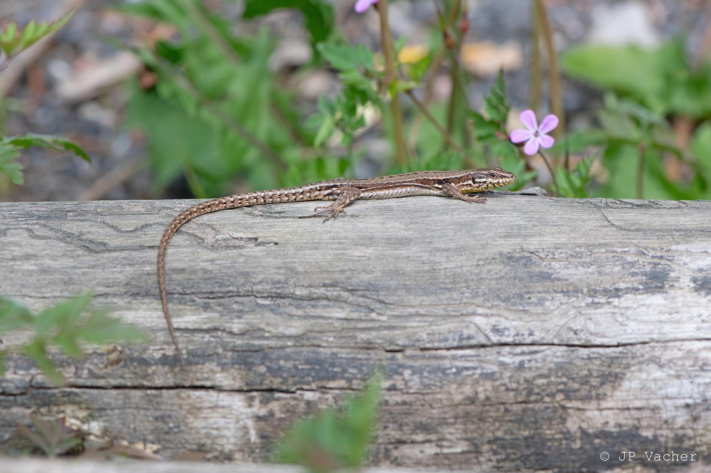

La Lorraine compte 8 espèces de reptiles autochtones, une espèce introduite.

# Lézards
- *Lacerta agilis*, le Lézard des souches
- *Podarcis muralis*, le Lézard des murailles
- *Zootoca vivipara*, le Lézard vivipare
- *Anguis fragilis*, l'Orvet fragile

# Serpents
- *Coronella austriaca*, la coronelle lisse
- *Hierophis viridiflavus*, la couleuvre verte et jaune
- *Natrix helvetica*, la Couleuvre à collier helvétique
- *Vipera aspis*, la Vipère aspic

Il existe une mention isolée de Couleuvre d'Esculape (*Zamenis longissimus*) dans le sud des Vosges datant des années 2000, l'espèce n'a pas été retrouvée depuis et nous n'avons jusqu'à présent aucune information sur une population établie et viable de cette espèce dans la région.

# Tortues
- *Trachemys scripta elegans*, la Tortue de Floride *introduite

Il existe des observations ponctuelles d'autres espèces de tortues importées, sans preuve de populations établies comme la Tortue de Floride.

:::{layout-ncol=2}

Couleuvre verte et jaune

Lézard des murailles

:::

